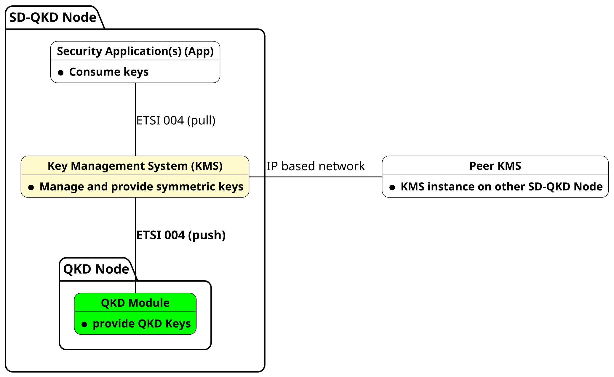
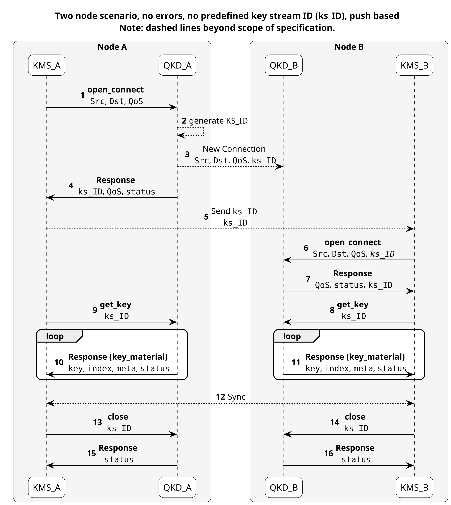

ETSI 004 QKD to KMS Interface <!-- omit in toc -->
==

- [1. Overview](#1-overview)
- [2. Specification](#2-specification)
  - [2.1. ETSI GS QKD 004](#21-etsi-gs-qkd-004)
  - [2.2. Specification format](#22-specification-format)
- [3. Sequence](#3-sequence)
- [4. Notes](#4-notes)
  - [4.1. Transport protocol](#41-transport-protocol)
  - [4.2. open-connect](#42-open-connect)
  - [4.3. get-key](#43-get-key)
  - [4.4. key-material](#44-key-material)
  - [4.5. close](#45-close)
- [5. Contribution](#5-contribution)
- [6. Related publications](#6-related-publications)
- [7. Acknowledgements](#7-acknowledgements)

# 1. Overview

This document describes the interface between the QKD Module (green) and the KMS (yellow). The KMS receives the key material from the QKD device. This document describes the implementation specifics for the push mode API.

# 2. Specification

## 2.1. ETSI GS QKD 004

**Note: The work published in this repository is not conducted by the ETSI group. This work has no official association nor support by ETSI directly.**

It is rather a derivation of the concepts outlined in the [ETSI GS QKD 004 v2.1.1](https://www.etsi.org/deliver/etsi_gs/QKD/001_099/004/02.01.01_60/gs_qkd004v020101p.pdf) specification to allow a push mode of operation. The main twist on the original specification is to make the response to the `get_key` request asynchronous and move it to a separate message. This moves the initiative from the KMS to the QKD device, which therefore can deliver a key whenever it produced one.

## 2.2. Specification format

The specification details are given in the OpenAPI specifications:

- [`QKD server`](./etsi_004_push_mode_qkd_server.yaml) for the endpoints hosted by the QKD server
- [`KMS server`](./etsi_004_push_mode_kms_server.yaml) for the endpoints hosted by the KMS server

For convenience static representations of the OpenAPI specification are provided:

- **HTML** representation (Webpage):
  - [QKD server (main branch)](https://ait-crypto.github.io/etsi-gs-qkd-004-push-mode-API-specification/main/html/qkd.html)
  - [KMS server (main branch)](https://ait-crypto.github.io/etsi-gs-qkd-004-push-mode-API-specification/main/html/kms.html)
- **PDF** representation:
  - [QKD server (main branch)](https://ait-crypto.github.io/etsi-gs-qkd-004-push-mode-API-specification/main/pdf/qkd.pdf)
  - [KMS server (main branch)](https://ait-crypto.github.io/etsi-gs-qkd-004-push-mode-API-specification/main/pdf/kms.pdf)

More info on the static representations for the specification in the corresponding [readme](./docs/readme.md).

This readme gives additional notes for the endpoints in the upcoming subsections.

# 3. Sequence

The following diagram shows the error free sequence diagram to be followed by the API.

Notes:

1. Dashed lines are beyond the scope of the interface and only given to hint at logical actions to happen.
2. The Response to the `get-key` is a separate message (`key-material`), not a direct response to the `get-key` command. This decoupling of request and response is done to allow push mode.
3. `get-key` and `key-material` have confirmations, which are not shown in the sequence diagram, those don't contain productive data and are only used for error communication and better control flow.

# 4. Notes

All relevant information is given in the OpenAPI specification, but some additional notes are given in this section.

## 4.1. Transport protocol

The used transport protocol is plain http, while https with TLS 1.3 (mTLS) is a recommended optional implementation.

For this reason method names as part of the url prefer the `-` over the `_` character, as it is more common typography in URLs. So for example `open-connect` is used in the path URL instead of `open_connect`, which is used in the ETSI specification.
Variable descriptions prefer the `_`, for example `key_stream_id`.

Some http error codes are defined in the OpenAPI description. However, all http error codes are acceptable as defined in [RFC 9110](https://datatracker.ietf.org/doc/html/rfc9110#name-status-codes). They should all contain the "status" field from the ETSI specification in their body.

## 4.2. open-connect

URI: `<authority>/api/v1/kms/etsi004/open-connect`

The `open-connect` message connects a KMS to the QKD Device. Conforming to the specification, the QKD device will assign the `key_stream_id` and can suggest alternative QoS due to its capabilities.

Notes:

1. Note on `key_stream_id`: According to the specification the requester (in this case the KMS) could specify the `key_stream_id`, though it is expected that the QKD module specifies it.
2. Note on `qos.metadata_mimetype`: It is always assumed to be "application/json".
3. Note on source and destination: They are in a point-to-point setup of the QKD device always the directly connected endpoints (no relay on QKD layer expected).

## 4.3. get-key

URI: `<authority>/api/v1/kms/etsi004/get-key`

The `get-key` message starts the key retrieval process.

Notes:

1. Note on `metadata`: currently not used.
2. Note on `GET` type: Some argue http `GET` methods should not have a body. This dates back to an interpretation of the phrasing in the older [RFC 7231](https://www.rfc-editor.org/rfc/rfc7231). The superseding [RFC 9110](https://www.rfc-editor.org/rfc/rfc9110.html) doesn't imply this anymore.
3. Note on response: The `get-key` message has its own response, which does not contain data. This is done to give the QKD layer an opportunity to signal errors to the KMS layer. The key data is then transmitted with the independent message `key-material`.

## 4.4. key-material

URI: `<authority>/api/v1/qkd/etsi004/key-material`

The `key-material` message accepts a key from the QKD Device.

Notes:

1. Note on `index`: index is supposed to be an increasing number, unique to the delivered key material.
2. Note on `metadata`: It includes the `key_stream_ID`, so the KMS can differentiate different delivered keys of different key streams.
3. Note on response: there is no logical need for the QKD device in push mode to get a response from the KMS, but it is implemented as a mean for better flow control capabilities.

## 4.5. close

URI: `<authority>/api/v1/kms/etsi004/close`

The `close` message disconnects the KMS from the QKD device.

# 5. Contribution

Please use the issue tracker to raise issues in the specification, they are very welcome.

# 6. Related publications

- James, P, Laschet, S, Ramacher, S & Torresetti, L 2023, Key Management Systems for Large-Scale Quantum Key Distribution Networks. in ARES '23: Proceedings of the 18th International Conference on Availability, Reliability and Security., 126, ACM International Conference Proceeding Series, S. 1-9, ARES 2023: The 18th International Conference on Availability, Reliability and Security, Benevento, Italy, 29/08/23. [https://doi.org/10.1145/3600160.3605050](https://doi.org/10.1145/3600160.3605050).
- Brito, JP, Ballesta, J, Brito-Mendez, R, Mengual, L, Ortíz, L, Martin, V, Cantó, R, Muñiz, A, Pastor, A, Lopez, D, Laschet, S, Ramacher, S, Piscione, P, Abdulwahed, AK, Giardina, P, Freitas, M, Calé, R, Maia, L, Magalhães, L, Anjos, G, Chaves, R, Afonso, J, Martins, P, Dias, T, Pinto, F, Vieira, M, Bacar, R & Bastos, C 2025, Secure Network Innovation in Defense: SDN and Quantum Cryptography with DISCRETION. in 2025 International Conference on Quantum Communications, Networking, and Computing (QCNC). S. 261 - 268, International Conference on Quantum Communications, Networking, and Computing (QCNC 2025), Nara, Japan, 31/03/25. [https://doi.org/10.1109/QCNC64685.2025.00049](https://doi.org/10.1109/QCNC64685.2025.00049).
- Bastos, C, Pinto, F, Bacar, R, Anjos, G, Almeida, M, Pinto, AN, Chaves, R, Dias, T, Afonso, J, Calé, R, Freitas, M, Maia, L, Magalhães, L, Muñiz, A, Cantó, R, Brito, JP, Ballesta, J, Méndez, RB, Laschet, S, Ramacher, S, James, P, Torresetti, L, Piscione, P, Abdulwahed, AK, Giardina, P, Martin, V, Ortiz, L, Pastor, A, Muga, N, Silva, N, López, D, Vieira, M, Escribano, C & Mengal, L 2025, DISCRETION: First Field Demonstration of a Quantum Enabled SDN in the Context of a Military Exercise. in 2025 International Conference on Military Communication and Information Systems (ICMCIS). S. 11-18, 2025 International Conference on Military Communication and Information Systems (ICMCIS), Oeiras, Portugal, 13/05/25. [https://doi.org/10.1109/icmcis64378.2025.11047713](https://doi.org/10.1109/icmcis64378.2025.11047713).

# 7. Acknowledgements

Different aspects of this work were enabled by Co-funding:

This project has received funding from the DIGITAL-2021-QCI-01 Digital European Program under Project number No 101091642("QCI-CAT") and the National Foundation for Research, Technology and Development.
From Digital Europe Program under project number 101091564 ("eCausis").
From European Union’s Horizon Europe research and innovation program under Grant Agreement No. 101114043 ("QSNP").

